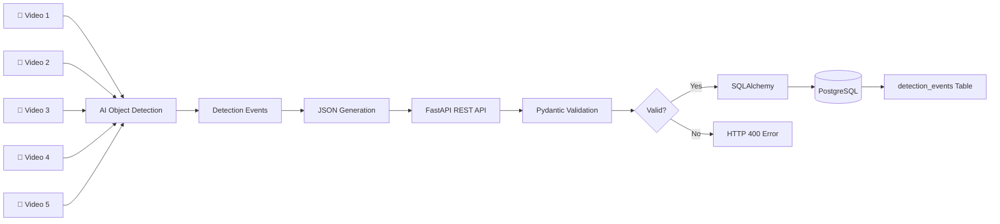
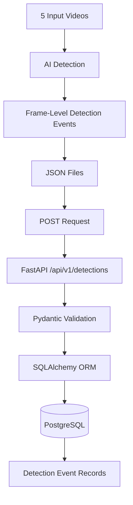
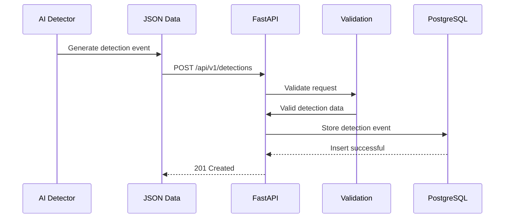
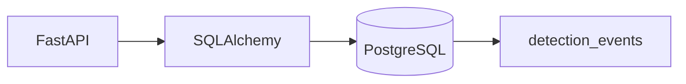
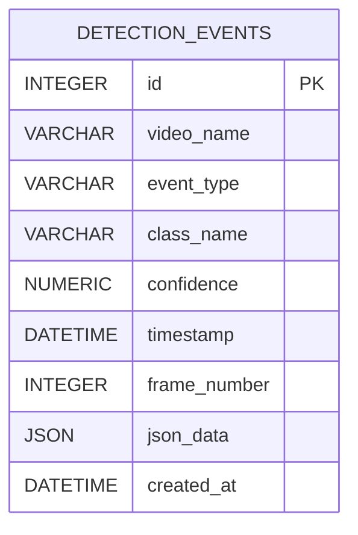
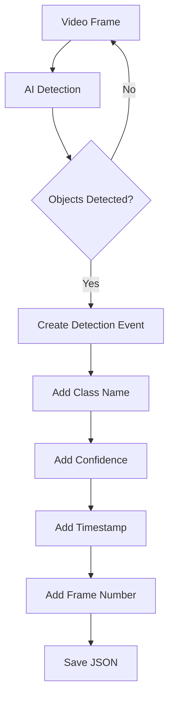
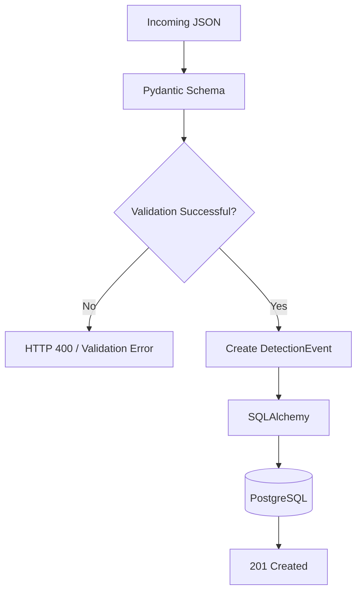
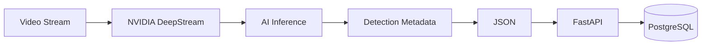
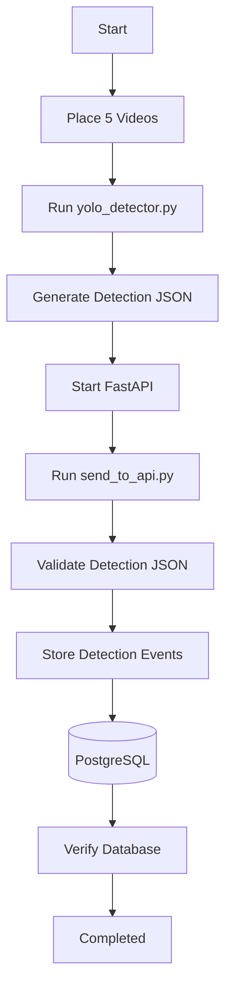

# 🚀 DeepStream FastAPI AI Detection Pipeline


An end-to-end AI video detection pipeline that processes multiple videos, generates object detection results in JSON format, sends the results to a FastAPI backend, validates the incoming detection events, and stores the validated results in PostgreSQL.

The project is designed with a backend architecture that can receive AI detection metadata generated by NVIDIA DeepStream.

---

# 📌 Table of Contents

- [Project Overview](#-project-overview)
- [Objectives](#-objectives)
- [System Architecture](#-system-architecture)
- [Complete Data Flow](#-complete-data-flow)
- [Detection Pipeline](#-detection-pipeline)
- [FastAPI Backend Flow](#-fastapi-backend-flow)
- [Database Architecture](#-database-architecture)
- [Project Structure](#-project-structure)
- [Technology Stack](#-technology-stack)
- [API Endpoints](#-api-endpoints)
- [JSON Detection Format](#-json-detection-format)
- [Database Schema](#-database-schema)
- [CORS](#-cors)
- [Logging](#-logging)
- [Video Processing](#-video-processing)
- [Validation](#-validation)
- [Issues Encountered](#-issues-encountered)
- [Solutions Implemented](#-solutions-implemented)
- [Testing and Results](#-testing-and-results)
- [Current DeepStream Limitation](#-current-deepstream-limitation)
- [Future Enhancements](#-future-enhancements)
- [How to Run](#-how-to-run)
- [Author](#-author)

---

# 🎯 Project Overview

This project implements a complete AI detection data pipeline.

Five input videos are processed through an AI object detection stage. The detection results are converted into structured JSON data. These JSON events are then sent to a versioned FastAPI REST API.

FastAPI validates the incoming data and stores the detection information in PostgreSQL.

Each detected object is stored as a separate database record while the complete incoming JSON response is preserved in the `json_data` column.

---

# 🎯 Objectives

The main objectives of this project were:

- Process five input videos.
- Perform AI-based object detection.
- Generate detection results in JSON format.
- Build a FastAPI backend.
- Implement API versioning.
- Implement CORS.
- Implement application logging.
- Receive AI detection results through FastAPI.
- Validate received detection events.
- Store validated events in PostgreSQL.
- Maintain a separate detection-events table.
- Store the complete detection JSON in the database.
- Design the backend so it can receive metadata from an NVIDIA DeepStream pipeline.

---

# 🏗️ System Architecture

The complete architecture of the project is:



---

# 🔄 Complete Data Flow



---

# 🤖 Detection Pipeline

The detection stage processes the input videos frame by frame.

A configurable frame interval is used to generate detection events instead of storing every single video frame.

Current configuration:

```text
Model:
YOLO11n

Confidence Threshold:
0.50

Frame Interval:
30 frames

Input:
5 MP4 videos

Output:
5 JSON files
```

The generated files are:

```text
detection_json/
├── video1_detections.json
├── video2_detections.json
├── video3_detections.json
├── video4_detections.json
└── video5_detections.json
```

---

# 🔌 FastAPI Backend Flow

The FastAPI backend receives the detection JSON generated by the detection stage.



---

# 📦 API Versioning

API versioning is implemented using:

```text
/api/v1/detections
```

This allows future API versions to be introduced without immediately breaking existing clients.

For example, future versions could use:

```text
/api/v2/detections
```

while keeping the existing version available.

---

# 🌐 CORS

Cross-Origin Resource Sharing (CORS) is configured using FastAPI middleware.

CORS allows the API to receive requests from applications running on different origins.

Current configuration supports:

```text
Origins:
*

Methods:
*

Headers:
*
```

CORS configuration is implemented in:

```text
main.py
```

---

# 📝 Logging

Application logging is implemented using Python's built-in `logging` module.

Logging is configured in:

```text
logger_config.py
```

Important events logged include:

- API endpoint access
- Detection event received
- Video name
- Frame number
- Successful database insertion
- Validation failures
- Database errors
- Detection event retrieval

Example log format:

```text
2026-09-10 10:30:00 - INFO - deepstream_api -
Detection event received | Video: video1.mp4 | Frame: 90
```

---

# 🗄️ Database Architecture

PostgreSQL is used as the persistent storage layer.

Database:

```text
deepstream_db
```

Main table:

```text
detection_events
```

Database flow:



---

# 📊 Detection Event Storage

A single detection request can contain multiple detected objects.

For example:

```text
Frame 90

person     0.92
chair      0.81
laptop     0.76
```

The API stores each detected object as a separate database row.

At the same time, the complete original JSON request is stored in:

```text
json_data
```

This provides both:

1. Structured searchable detection data.
2. The complete original detection response.

---

# 🧩 Database Schema



---

# 📋 Detection Events Table

| Column | Type | Description |
|---|---|---|
| `id` | Integer | Primary key |
| `video_name` | String | Name of input video |
| `event_type` | String | Type of detection event |
| `class_name` | String | Detected object class |
| `confidence` | Numeric | AI detection confidence |
| `timestamp` | DateTime | Detection timestamp |
| `frame_number` | Integer | Video frame number |
| `json_data` | JSON | Complete detection JSON |
| `created_at` | DateTime | Database insertion timestamp |

---

# 📁 Project Structure

```text
deepstream_fastapi_project/
│
├── api/
│   ├── __init__.py
│   │
│   └── v1/
│       ├── __init__.py
│       └── detections.py
│
├── detection_json/
│   ├── video1_detections.json
│   ├── video2_detections.json
│   ├── video3_detections.json
│   ├── video4_detections.json
│   └── video5_detections.json
│
├── videos/
│   ├── video1.mp4
│   ├── video2.mp4
│   ├── video3.mp4
│   ├── video4.mp4
│   └── video5.mp4
│
├── database.py
├── logger_config.py
├── main.py
├── models.py
├── requirements.txt
├── send_to_api.py
├── yolo_detector.py
├── .gitignore
└── README.md
```

---

# 🛠️ Technology Stack

| Technology | Purpose |
|---|---|
| Python | Main programming language |
| YOLO | AI object detection |
| FastAPI | REST API backend |
| Pydantic | Request validation |
| SQLAlchemy | ORM/database interaction |
| PostgreSQL | Persistent database |
| Requests | Sending JSON to API |
| Uvicorn | FastAPI application server |
| NVIDIA DeepStream | Target production inference pipeline |

---

# 🔗 API Endpoints

## API Test

```http
GET /api/v1/detections/test
```

Example response:

```json
{
    "message": "Detection API v1 is working"
}
```

---

## Create Detection Event

```http
POST /api/v1/detections
```

This endpoint:

1. Receives detection JSON.
2. Validates the request.
3. Validates detection objects.
4. Stores the detection information.
5. Returns generated database IDs.

---

## Get All Detection Events

```http
GET /api/v1/detections
```

Returns all stored detection events.

---

## Get Detection Event

```http
GET /api/v1/detections/{event_id}
```

Returns a specific detection event using its database ID.

---

# 🧾 JSON Detection Format

Example detection request:

```json
{
    "video_name": "video1.mp4",
    "event_type": "object_detection",
    "timestamp": "2026-09-10T10:30:00",
    "frame_number": 90,
    "detections": [
        {
            "class_name": "person",
            "confidence": 0.9234
        },
        {
            "class_name": "chair",
            "confidence": 0.8123
        }
    ]
}
```

---

# 🔍 JSON Processing Flow



---

# ✅ Validation

The FastAPI backend validates incoming detection events before database insertion.

Validation includes:

### Video Name

```text
Required
```

### Event Type

```text
Required
```

### Timestamp

```text
Valid datetime required
```

### Frame Number

```text
Must be >= 0
```

### Detection List

```text
At least one detection required
```

### Class Name

```text
Must not be empty
```

### Confidence

```text
0.0 <= confidence <= 1.0
```

---

# 🔐 Validation and Storage Flow



---

# ⚠️ Issues Encountered

During development, several issues were encountered and resolved.

## 1. NVIDIA DeepStream Availability

The development laptop did not have an NVIDIA GPU or NVIDIA DeepStream environment available.

The system reported:

```text
nvidia-smi
command not found
```

and:

```text
deepstream-app
not recognized
```

The available graphics hardware was:

```text
Intel(R) UHD Graphics 620
```

Therefore, the NVIDIA DeepStream runtime could not be executed on the current development machine.

---

## 2. CPU-Only PyTorch

The available PyTorch installation was CPU-only.

The environment reported:

```text
PyTorch 2.8.0+cpu
```

and:

```text
torch.cuda.is_available()
False
```

---

## 3. Python Type Annotation Compatibility

An issue occurred when using the newer union syntax:

```python
int | None
```

The project was running on Python 3.9, where this syntax is not supported in the same way as newer Python versions.

The solution was to use:

```python
Optional[int]
```

from the `typing` module.

---

## 4. JSON Datetime Serialization

Initially, the complete Pydantic request was directly converted into a dictionary.

This caused an issue because the `datetime` object could not be directly serialized into JSON for database storage.

The solution was to convert the Pydantic model to JSON first and then load it back as a Python dictionary.

Conceptually:

```text
Pydantic Object
      ↓
JSON Serialization
      ↓
JSON-compatible Dictionary
      ↓
PostgreSQL JSON Column
```

---

## 5. Multiple Detections in One Frame

A single frame can contain multiple detected objects.

For example:

```text
Frame 180

person
chair
laptop
mouse
```

Instead of storing all objects as one flat database record, the API creates separate rows for each detected object.

The original complete JSON remains available in:

```text
json_data
```

---

# ✅ Solutions Implemented

| Issue | Solution |
|---|---|
| No NVIDIA DeepStream environment | Used YOLO for practical detection-stage testing |
| CPU-only PyTorch | Executed inference using CPU |
| Python 3.9 annotation issue | Used `Optional[...]` typing |
| Datetime JSON serialization | Converted request to JSON-safe dictionary |
| Multiple detections per frame | Stored one row per detected object |
| Need complete original response | Stored complete JSON in `json_data` |
| API evolution | Implemented `/api/v1` versioning |
| Cross-origin requests | Added CORS middleware |
| Debugging and monitoring | Added structured logging |

---

# 🧪 Testing and Results

The complete pipeline was tested using five videos.

```text
Videos processed:
5
```

Detection JSON files generated:

```text
5
```

Detection events sent to FastAPI:

```text
99
```

Successful API requests:

```text
99
```

Failed API requests:

```text
0
```

Database rows verified:

```text
177
```

---

# 📈 Test Result Flow


---

# 📊 Video Processing Results

| Video | Frames Processed | Detection Events |
|---|---:|---:|
| `video1.mp4` | 274 | 9 |
| `video2.mp4` | 601 | 17 |
| `video3.mp4` | 450 | 14 |
| `video4.mp4` | 1,739 | 51 |
| `video5.mp4` | 240 | 8 |
| **Total** | **3,304** | **99** |

---

# 🗃️ Database Verification

The PostgreSQL database was verified after API processing.

Example query:

```sql
SELECT
    id,
    video_name,
    event_type,
    class_name,
    confidence,
    timestamp,
    frame_number,
    json_data,
    created_at
FROM detection_events
ORDER BY id DESC;
```

The database contained:

```text
177 detection rows
```

The latest inserted rows appear first when using:

```sql
ORDER BY id DESC;
```

---

# 🚀 Current DeepStream Limitation

The intended production architecture is:



However, the current development laptop does not provide an NVIDIA DeepStream-compatible environment.

Therefore, the detection stage was implemented using YOLO to validate the complete data pipeline.

The backend architecture was kept detector-independent.

This means the FastAPI endpoint can receive compatible detection JSON from a future NVIDIA DeepStream pipeline without requiring the database architecture to be redesigned.

---

# 🔮 Future Enhancements

The project can be extended in several directions.

## 1. NVIDIA DeepStream Integration

Run the detection pipeline on an NVIDIA GPU using:

```text
NVIDIA DeepStream
TensorRT
NVIDIA GPU
```

The DeepStream pipeline can generate detection metadata and forward it to the existing FastAPI backend.

---

## 2. Real-Time Video Streams

Instead of processing only MP4 files, future versions can support:

```text
RTSP Camera
     ↓
DeepStream
     ↓
Inference
     ↓
FastAPI
     ↓
PostgreSQL
```

---

## 3. GPU-Accelerated Inference

Move inference from CPU to GPU for faster processing of large video streams.

---

## 4. Authentication

Add authentication and authorization to the FastAPI backend.

Possible implementation:

```text
JWT Authentication
Role-Based Access Control
API Keys
```

---

## 5. Better Database Optimization

Future versions can use PostgreSQL-specific optimizations such as:

```text
JSONB
Indexes
Partitioning
Connection pooling
```

for large-scale detection workloads.

---

## 6. Detection Analytics Dashboard

A frontend dashboard could visualize:

- Detection counts
- Confidence scores
- Video statistics
- Frame-level events
- Object frequency
- Detection timestamps

Possible architecture:


---

## 7. Real-Time Notifications

Future versions could generate alerts for selected objects or events.

Example:

```text
Person detected
        ↓
Detection Rule
        ↓
Alert Service
        ↓
Notification
```

---

## 8. Docker Deployment

The complete application can be containerized using Docker.

Possible deployment:

```text
Docker
├── FastAPI
├── PostgreSQL
├── AI Detection Service
└── DeepStream / GPU Runtime
```

---

## 9. Cloud Deployment

The system could eventually be deployed to a cloud GPU infrastructure for scalable video processing.

---

# ▶️ How to Run

## 1. Clone the Repository

```bash
git clone https://github.com/AkramKhan543719/deepstream-fastapi-detection.git
```

Enter the project directory:

```bash
cd deepstream-fastapi-detection
```

---

## 2. Install Dependencies

```powershell
pip install -r requirements.txt
```

---

## 3. Configure PostgreSQL

Create a PostgreSQL database:

```text
deepstream_db
```

The current application expects PostgreSQL to be available on:

```text
localhost:5432
```

Database configuration is located in:

```text
database.py
```

---

## 4. Start FastAPI

Run:

```powershell
uvicorn main:app --reload
```

The API will be available at:

```text
http://127.0.0.1:8000
```

Swagger documentation:

```text
http://127.0.0.1:8000/docs
```

---

# 🤖 Run AI Detection

Place videos inside:

```text
videos/
```

Run:

```powershell
python yolo_detector.py
```

The generated JSON files will appear inside:

```text
detection_json/
```

---

# 📤 Send Detection Results to API

Start FastAPI first:

```powershell
uvicorn main:app --reload
```

Then run:

```powershell
python send_to_api.py
```

The script reads all JSON files and sends the detection events to:

```text
/api/v1/detections
```

---

# 🔁 End-to-End Execution

The complete execution sequence is:



---

# 📚 Main Files

## `main.py`

Creates the FastAPI application and configures:

- FastAPI
- CORS
- Logging
- API routers
- Database tables

---

## `database.py`

Handles:

- PostgreSQL connection
- SQLAlchemy engine
- Session creation
- Database dependency

---

## `models.py`

Defines the SQLAlchemy database model:

```text
DetectionEvent
```

---

## `api/v1/detections.py`

Contains:

- Pydantic schemas
- Validation
- POST detection endpoint
- GET detection endpoints
- Database insertion
- Logging

---

## `yolo_detector.py`

Responsible for:

- Loading the AI model
- Processing videos
- Running object detection
- Creating frame-level detection events
- Generating JSON files

---

## `send_to_api.py`

Responsible for:

- Reading detection JSON files
- Sending events to FastAPI
- Tracking successful requests
- Tracking failed requests

---

## `logger_config.py`

Provides the application's logging configuration.

---

# 🏁 Project Status

```text
╔══════════════════════════════════════════╗
║       PROJECT STATUS: COMPLETED          ║
╠══════════════════════════════════════════╣
║ Videos Processed          : 5            ║
║ JSON Files Generated      : 5            ║
║ Detection Events Sent     : 99           ║
║ Successful API Requests   : 99           ║
║ Failed API Requests       : 0            ║
║ Database Rows Verified    : 177          ║
║ FastAPI                   : Completed    ║
║ PostgreSQL                : Completed    ║
║ CORS                      : Completed    ║
║ Logging                   : Completed    ║
║ API Versioning            : Completed    ║
╚══════════════════════════════════════════╝
```

---

# 👨‍💻 Author

**Pathan Mohammed Akram Khan**

BTech - Computer Science and Engineering  
AI & ML

---

# ⭐ Project Repository

GitHub:

https://github.com/AkramKhan543719/deepstream-fastapi-detection
